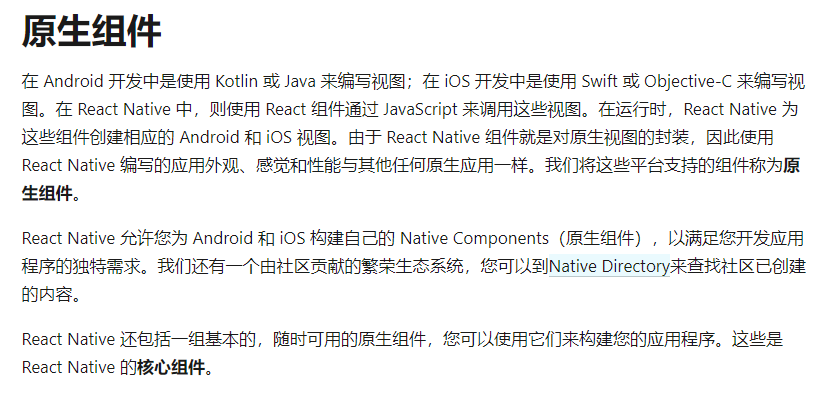
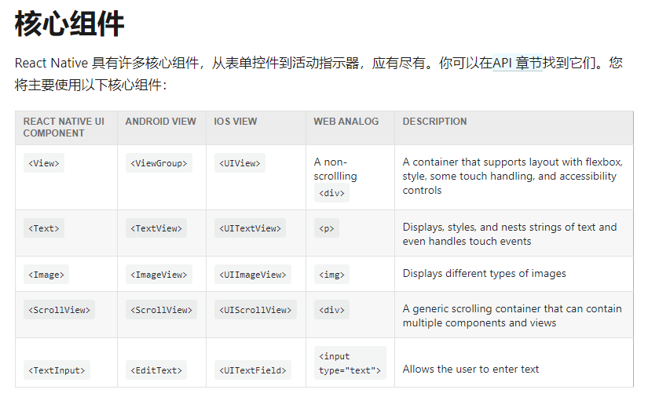
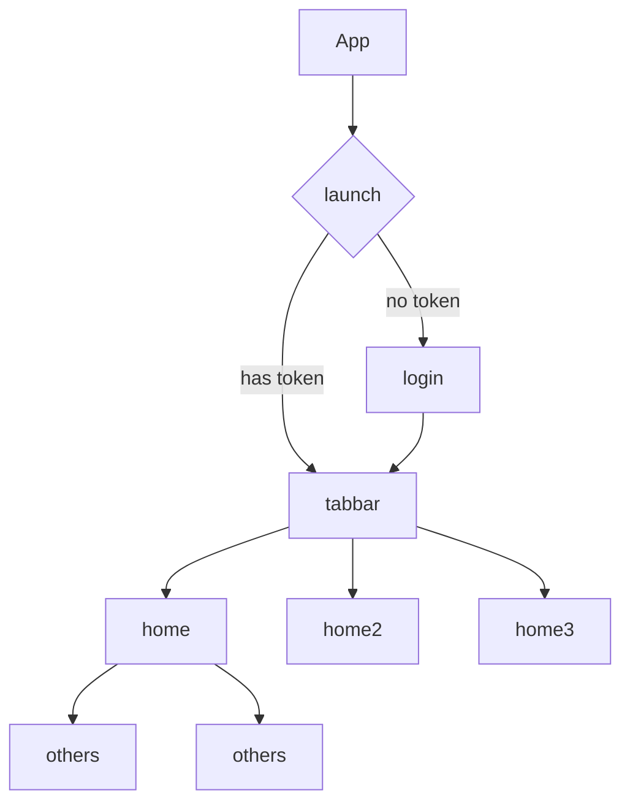

# whir-react-native

A peripheral tools of react native, Including dva,antd mobile,async-storage,@react-navigation and more library

## TODO-LIST

- [x] `@whir-react-native/utils` utils，包含常用的工具函数
- [ ] `@whir-react-native/hooks` hooks，包含常用的 React hooks
- [x] `@whir-react-native/components` 组件库，包含常用的 UI 组件
- [x] `@whir-react-native/react-native-template` react-native 模板
- [ ] react-native 整体技术方案总结
- [ ] 文档生成
- [ ] 文档持续部署
- [ ] 如何参与本项目（包含 Lint, Test, MR 等相关说明）

## Getting Started

已有的项目：
```bash
yarn add @whir-react-native/utils @whir-react-native/components
```

新项目：
```bash
npx react-native init MyApp --template @whir-react-native/react-native-template
```

### 基本项目配置

#### 1. 如果使用的是 @whir-react-native/react-native-template 模板，可以直接使用

#### 2. 安装了相关依赖的使用方式：

创建目录 src/models

创建文件 src/models/index.js 导出所有的dva.js models
```js
// src/models/index.js
module.exports = [
  require("./demo").default,
]
```

创建文件 src/index.js

src/App.js 为 ```@react-navigation/native``` 提供的路由组件
```js
// src/index.js
import models from "./models";
import App from "./App";

export default {
    models,
    App
}
```

修改 根目录下的 /index.js 文件
```js
/** /index.js */
import { AppRegistry } from 'react-native'
import { createDvaApp } from '@whir-react-native/utils'
import appConfig from './src/index'
import { name as appName } from './app.json'

AppRegistry.registerComponent(appName, () => createDvaApp(appConfig))
```

现在，你可以使用到 dva.js，antd-mobile，@react-navigation/native 的相关功能了
## 相关文档

- [react-native 介绍](./doc/react-native.md)

## 为什么它是原生APP




## 样式

- fixStyleSheet 方法添加样式

> 为了适应不同屏幕的显示效果，`fixStyleSheet` 函数提供的一个约定，以 750 为屏幕宽度自适应不同的屏幕，设计师出的图也是 750px 的，所以这里直接使用设计图提供的数值即可

```jsx
import { fixStyleSheet } from '@whir-react-native/utils'
const Demo = () => (
  <View style={styles.demo}>
    <Text style={styles.text}>test</Text>
  </View>
)

const styles = fixStyleSheet({
  demo: {
    width: 100,
    height: 100,
  },
  text: {
    fontSize: 28,
  },
})
```

- 如果想直接为 style 传值（内联样式），同样提供了 `setPX` 方法

```jsx
import { setPX } from '@whir-react-native/utils'
const Demo = () => <View style={{ width: setPX(100), height: setPX(100) }} />
```

### 一些注意事项（与 web 项目不同之处）：

- flex 布局

1. 所有的组件都是采用的 flex 布局，且默认的 flexDirection 为 column
2. flex 属性决定元素在主轴上如何填满可用区域。整个区域会根据每个元素设置的 flex 属性值被分割成多个部分。

> 在下面的例子中，在设置了 flex: 1 的容器 view 中，有红色，黄色和绿色三个子 view。红色 view 设置了 flex: 1，黄色 view 设置了 flex: 2，绿色 view 设置了 flex: 3。1+2+3 = 6，这意味着红色 view 占据整个区域的 1/6，黄色 view 占据整个区域的 2/6，绿色 view 占据整个区域的 3/6。

```jsx
const FlexDirectionBasics = () => {
  return (
    <View style={{ flex: 1 }}>
      <View style={{ flex: 1, backgroundColor: 'red' }} />
      <View style={{ flex: 2, backgroundColor: 'yellow' }} />
      <View style={{ flex: 3, backgroundColor: 'green' }} />
    </View>
  )
}
```

- 多个样式添加

```jsx
// 组件的style属性支持传递数组
const Demo = () => <View style={[styles.demo, styles.demo2]} />

const styles = fixStyleSheet({
  demo: {
    width: 100,
    height: 100,
  },
  demo2: {
    backgroundColor: '#000',
  },
})
```

## 路由

项目采用的是 [`@react-navigation/native`](https://reactnavigation.org/) 路由方案, 有 stack 路由和 TabNavigator

1. 基础路由设计



2. 路由跳转

- 向 stack 路由跳转

```ts
navigation.navigate(name: string, params: object)

// 重定向路由
navigation.reset({
  index: number,
  routes: [{ name: string, params: object }],
})
```

- 向 tabbar 跳转

```ts
navigation.navigate(name: 'tabbar', params: object)

// 重定向路由
navigation.reset({
  index: number,
  routes: [{ name: 'tabbar', params: object }],
})
```

## 安卓返回键

> 经过 BasicNavigationContainer 组件处理后，只有在根路由的时候双击返回键为退出应用，其他情况为返回上一级路由，如果要覆盖此效果，请使用 `import { addBackPressListener, removeBackPressListener } from '@whir-react-native/utils' `

```jsx
import { Modal, Button } from '@ant-design/react-native'

export default () => {
  const [modalVisible, setModalVisible] = useState(false)

  const handleOpenDetail = () => {
    setModalVisible(true)
    addBackPressListener(handleCloseModal)
  }

  const handleCloseModal = async () => {
    await setModalVisible(false)
    removeBackPressListener()
  }

  return (
    <Modal visible={modalVisible} maskClosable={false}>
      <Text>弹窗</Text>
      <Button onPress={handleCloseModal}>关闭</Button>
    </Modal>
  )
}
```


## 业务项目代码约定
```code
├── android                           // Android 工程目录
├── ios                               // Ios 工程目录
├── src
│   ├── assets                        // 一般放图片
│   ├── components                    // 组件目录
│       ├── Button
│       ├── ...other
│       ├── index.tsx                 // 统一导出
│   ├── models                        // dva models
│   └── routers                       // 路由页面
│       ├── home
│       └── login
│   └── styles                        // 可抽离的样式
│       └── resetText.js              // 重设Text样式
│   └── App.js                        // 路由定义
│   └── index.js                      // 导出App 和 models
```